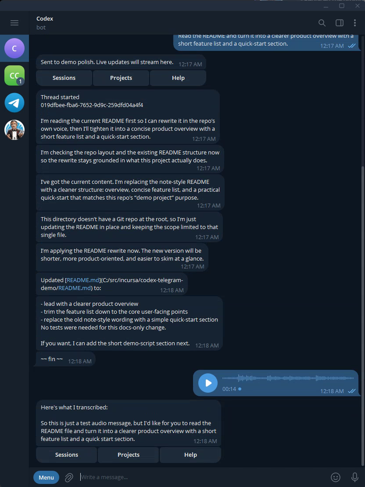

# Incursa Codex Telegram

Incursa Codex Telegram lets you talk to a local Codex CLI session from a private Telegram chat. It runs on your own machine, stores state locally, and only accepts messages from allowlisted Telegram users.

Use it when you want to start, steer, and inspect Codex work from your phone without exposing your whole machine to Telegram users.

## Demo

Watch a two-minute private-chat demo showing a local Codex session controlled from Telegram with project selection, text prompts, and voice input.

[](https://github.com/incursa/codex-telegram/raw/main/docs/assets/codex-telegram-demo.mp4)

For the available Telegram buttons and menus, see the [menus and button reference](docs/menus.md).

## Download

Download the latest release binary for your operating system:

| Platform | Download | Checksum |
| --- | --- | --- |
| Windows x64 | [codex-telegram-win-x64.exe](https://github.com/incursa/codex-telegram/releases/latest/download/codex-telegram-win-x64.exe) | [sha256](https://github.com/incursa/codex-telegram/releases/latest/download/codex-telegram-win-x64.exe.sha256) |
| Linux x64 | [codex-telegram-linux-x64](https://github.com/incursa/codex-telegram/releases/latest/download/codex-telegram-linux-x64) | [sha256](https://github.com/incursa/codex-telegram/releases/latest/download/codex-telegram-linux-x64.sha256) |
| macOS arm64 | [codex-telegram-osx-arm64](https://github.com/incursa/codex-telegram/releases/latest/download/codex-telegram-osx-arm64) | [sha256](https://github.com/incursa/codex-telegram/releases/latest/download/codex-telegram-osx-arm64.sha256) |

All releases are listed at [GitHub Releases](https://github.com/incursa/codex-telegram/releases).

## What You Need

Before starting, have these ready:

1. A Telegram account.
2. A Telegram bot token from `@BotFather`.
3. A local Codex CLI installation that already works in a terminal.
4. At least one local repository or workspace directory you want Codex to use.
5. Optional: an OpenAI API key for voice-note transcription. Install `ffmpeg` only if Telegram audio must be transcoded; Telegram voice notes commonly need it.

This app does not bundle Codex, Telegram credentials, or OpenAI credentials. If you use voice notes, any required audio transcoder must already exist on the machine running the bot.

For Codex CLI setup, use OpenAI's official [Codex CLI docs](https://developers.openai.com/codex/cli).

## Quick Start

Start by creating a Telegram bot, then follow the complete setup path for your operating system.

### Create A Telegram Bot

In Telegram:

1. Open a chat with `@BotFather`.
2. Send `/newbot`.
3. Choose a display name.
4. Choose a username ending in `bot`.
5. Copy the bot token.

Keep the token private. Anyone with the token can control the bot account.

Recommended BotFather settings for a first private-chat release:

1. Let the app sync its command list, description, short description, and conservative group-admin defaults automatically on startup.
2. Keep group joins disabled unless you intentionally want group support.
3. Keep privacy mode enabled unless you intentionally need ordinary group text routed to Codex.
4. Add a profile image manually if you want one.

Copy-paste BotFather text, command lists, and privacy recommendations are in [BotFather setup](docs/botfather.md).

BotFather gives you the bot token, but it cannot give you your personal Telegram user ID. On first run, Codex Telegram can validate the bot token, show a random setup code in the terminal, wait for one private message containing that code, and save your user ID automatically.

### Windows

Use this path if the bot will run on Windows x64.

1. Download `codex-telegram-win-x64.exe` and `codex-telegram-win-x64.exe.sha256` from the [latest release](https://github.com/incursa/codex-telegram/releases/latest).
2. Optional but recommended: verify the checksum before renaming or moving the file.

```powershell
Get-FileHash .\codex-telegram-win-x64.exe -Algorithm SHA256
Get-Content .\codex-telegram-win-x64.exe.sha256
```

3. Put the binary in a stable folder.

```powershell
New-Item -ItemType Directory -Force C:\tools\codex-telegram | Out-Null
Move-Item .\codex-telegram-win-x64.exe C:\tools\codex-telegram\codex-telegram.exe
Set-Location C:\tools\codex-telegram
```

4. Confirm Codex works locally before involving Telegram.

```powershell
codex --version
codex
```

5. Start the setup menu from the app folder.

```powershell
.\codex-telegram.exe
```

6. Complete the first-run wizard.

Use these values as a starting point:

```text
Telegram bot token: <token from BotFather>
Telegram polling: enabled
Admin user ID: let the wizard capture it by sending one private Telegram message to the bot
Codex executable path: leave blank if codex is on PATH, otherwise set the full codex.exe path
Workspace root: C:\src
Default working directory: C:\src\your-repo
OpenAI transcription: only if you want voice notes
Local data root: leave blank unless you need a custom state folder
```

The app writes `appsettings.Local.json` beside the executable by default. Keep that file local and untracked. If you launch the app from another command-line directory later, it still uses the settings file in the app folder.

7. Start normal operation with the menu skipped.

```powershell
.\codex-telegram.exe --run
```

Keep that terminal open, or run the app under your preferred Windows service manager.

8. In the private Telegram chat, run the first private Codex session.

```text
/doctor
/projects
/project add C:\src\your-repo
/new release-demo
Summarize this repository and tell me the next safest setup check to run.
/tail
```

At this point you have a working private Telegram chat connected to a local Codex session.

### Linux

Use this path if the bot will run on Linux x64.

1. Download `codex-telegram-linux-x64` and `codex-telegram-linux-x64.sha256` from the [latest release](https://github.com/incursa/codex-telegram/releases/latest).
2. Or download both files directly with `curl`.

```bash
curl -fL -o codex-telegram-linux-x64 https://github.com/incursa/codex-telegram/releases/latest/download/codex-telegram-linux-x64
curl -fL -o codex-telegram-linux-x64.sha256 https://github.com/incursa/codex-telegram/releases/latest/download/codex-telegram-linux-x64.sha256
```

3. Optional but recommended: verify the checksum before renaming or moving the file.

```bash
shasum -a 256 -c ./codex-telegram-linux-x64.sha256
```

4. Put the binary in a stable folder and mark it executable.

```bash
mkdir -p ~/tools/codex-telegram
mv ./codex-telegram-linux-x64 ~/tools/codex-telegram/codex-telegram
chmod +x ~/tools/codex-telegram/codex-telegram
cd ~/tools/codex-telegram
```

5. Confirm Codex works locally before involving Telegram.

```bash
codex --version
codex
```

6. Start the setup menu from the app folder.

```bash
./codex-telegram
```

7. Complete the first-run wizard.

Use these values as a starting point:

```text
Telegram bot token: <token from BotFather>
Telegram polling: enabled
Admin user ID: let the wizard capture it by sending one private Telegram message to the bot
Codex executable path: leave blank if codex is on PATH, otherwise set the full codex path
Workspace root: /home/you/src
Default working directory: /home/you/src/your-repo
OpenAI transcription: only if you want voice notes
Local data root: leave blank unless you need a custom state folder
```

The app writes `appsettings.Local.json` beside the executable by default. Keep that file local and untracked. If you launch the app from another command-line directory later, it still uses the settings file in the app folder.

8. Start normal operation with the menu skipped.

```bash
./codex-telegram --run
```

Keep that terminal open, or run the app under systemd, tmux, screen, or another process supervisor.

9. In the private Telegram chat, run the first private Codex session.

```text
/doctor
/projects
/project add /home/you/src/your-repo
/new release-demo
Summarize this repository and tell me the next safest setup check to run.
/tail
```

At this point you have a working private Telegram chat connected to a local Codex session.

### macOS

Use this path if the bot will run on Apple Silicon macOS.

1. Download `codex-telegram-osx-arm64` and `codex-telegram-osx-arm64.sha256` from the [latest release](https://github.com/incursa/codex-telegram/releases/latest).
2. Or download both files directly with `curl`.

```bash
curl -fL -o codex-telegram-osx-arm64 https://github.com/incursa/codex-telegram/releases/latest/download/codex-telegram-osx-arm64
curl -fL -o codex-telegram-osx-arm64.sha256 https://github.com/incursa/codex-telegram/releases/latest/download/codex-telegram-osx-arm64.sha256
```

3. Optional but recommended: verify the checksum before renaming or moving the file.

```bash
shasum -a 256 -c ./codex-telegram-osx-arm64.sha256
```

4. Put the binary in a stable folder and mark it executable.

```bash
mkdir -p ~/tools/codex-telegram
mv ./codex-telegram-osx-arm64 ~/tools/codex-telegram/codex-telegram
chmod +x ~/tools/codex-telegram/codex-telegram
cd ~/tools/codex-telegram
```

5. If macOS blocks the binary because it was downloaded from the internet, verify the checksum first. If you trust the release, remove the quarantine attribute.

```bash
xattr -d com.apple.quarantine ~/tools/codex-telegram/codex-telegram
```

6. Confirm Codex works locally before involving Telegram.

```bash
codex --version
codex
```

7. Start the setup menu from the app folder.

```bash
./codex-telegram
```

8. Complete the first-run wizard.

Use these values as a starting point:

```text
Telegram bot token: <token from BotFather>
Telegram polling: enabled
Admin user ID: let the wizard capture it by sending one private Telegram message to the bot
Codex executable path: leave blank if codex is on PATH, otherwise set the full codex path
Workspace root: /Users/you/src
Default working directory: /Users/you/src/your-repo
OpenAI transcription: only if you want voice notes
Local data root: leave blank unless you need a custom state folder
```

The app writes `appsettings.Local.json` beside the executable by default. Keep that file local and untracked. If you launch the app from another command-line directory later, it still uses the settings file in the app folder.

9. Start normal operation with the menu skipped.

```bash
./codex-telegram --run
```

Keep that terminal open, or run the app under launchd, tmux, screen, or another process supervisor.

10. In the private Telegram chat, run the first private Codex session.

```text
/doctor
/projects
/project add /Users/you/src/your-repo
/new release-demo
Summarize this repository and tell me the next safest setup check to run.
/tail
```

At this point you have a working private Telegram chat connected to a local Codex session.

## Voice Notes

Voice notes are optional. The bot downloads Telegram audio, transcribes it with OpenAI, shows the transcript, and sends only the transcribed text to the active Codex session. Codex does not receive raw Telegram audio.

Voice note requirements:

1. `OpenAI:ApiKey` or `OPENAI_API_KEY`.
2. A transcription-capable `OpenAI:Model`.
3. `ffmpeg` only when the downloaded audio is not in a format OpenAI accepts directly. Telegram voice notes commonly arrive as OGG/OPUS, so install `ffmpeg` or configure `OpenAI:FfmpegPath` for reliable voice-note support.

If `ffmpeg` is missing when a voice note needs conversion, the bot leaves the Codex session untouched and replies with setup guidance instead of failing silently.

Suggested first voice test:

```text
Please review the current project and tell me the three most important setup risks. Keep it concise and do not edit files.
```

After a successful test, you should see the transcription in Telegram before the Codex response starts.

## Day-To-Day Commands

| Command | Use |
| --- | --- |
| `/doctor` | Explain authorization, routing, active project/session, workspace roots, queue state, and next action. |
| `/help` | Show the built-in command summary. |
| `/whoami` | Show Telegram user, chat, and topic IDs for setup and troubleshooting. |
| `/version` | Show the running app version. |
| `/trust` | Trust the current group or forum chat for allowlisted users. |
| `/projects` | List known local project directories. |
| `/project add <path>` | Add and select a repository or workspace. |
| `/project current` | Confirm the active project for this Telegram conversation. |
| `/new [name]` | Create and select a fresh Codex session; omit the name to auto-generate one from the active project. |
| `/sessions` | Show active and Telegram-managed sessions. |
| `/sessions all [count]` | Show older Codex history. |
| `/use <sessionId>` | Resume an existing session. |
| `/send <text>` | Explicitly send text when privacy mode or chat type prevents normal auto-routing. |
| `/steer <text>` | Add guidance to a currently active turn. |
| `/queue` | View queued prompts for the conversation, then edit, delete, or send one now. |
| `/model` | Show or change the active session model. |
| `/thinking` | Show or change reasoning effort. |
| `/goal` | Show, set, pause, resume, complete, or clear the active session goal. |
| `/status` | Show active session status, including compact Codex usage when available. |
| `/usage` | Show five-hour and weekly Codex usage, with reset times. |
| `/tail [lines]` | Show recent output and keep following the session; defaults to 40 lines. |
| `/outbound` | Inspect delayed or batched Telegram output. |
| `/stop` | Gracefully stop a session. |
| `/restart confirm` | Show standalone-process restart guidance. |
| `/launchpad on\|off\|status` | Arm or disarm root-chat launch mode for plain-text or audio launches; launchpad names lanes from the group title plus a sequence number. |
| `/launch <name> [\| <path>]` | Create a detached git worktree-backed forum topic and Codex session while launchpad is armed. |
| `/topic ...` | Manage forum-topic sessions in allowed supergroups. |

For a fuller operator guide, see [docs/usage.md](docs/usage.md).
For every command, parameter, and expected behavior, see [docs/command-reference.md](docs/command-reference.md).

## How Output Delivery Works

Telegram output is rate-limited and batched so active Codex sessions do not flood your chat.

Practical rules:

1. Use `/tail` before assuming Telegram scrollback contains the full transcript.
2. Use `/outbound` if messages seem delayed.
3. Use `/usage` when you need current five-hour and weekly Codex usage percentages and reset times.
4. Batched messages are concatenated with simple spacing and preserve multi-line content, including numbered lists and headings.
5. If the local outbound buffer is compacted, the bot sends an explicit compaction notice.
6. A final `~~ fin ~~` marker means the turn reached a terminal event.

## Local State And Safety

The app stores local state under `CodexTelegram:Workspace:DataRoot`. By default, that is the user's application data folder.

State includes:

1. `projects.json`
2. `telegram-state.json`
3. Per-thread manifests

Secrets should stay in `appsettings.Local.json`, user secrets, environment variables, or another secret store. Secrets are not supposed to be written to the state files.

Security rules:

1. Keep `TelegramBot:AllowedUserIds` narrow.
2. Keep `TelegramBot:AllowedChatIds` empty unless you intentionally want config-managed group or forum-topic access.
3. Set explicit workspace roots and a default working directory before enabling polling.
4. Review Codex sandbox and approval settings before exposing sensitive repositories.
5. Rotate the BotFather token if it is exposed.

## Supported Modes

Private chat is the recommended first setup path. Trusted groups and forum topics are also supported conversation scopes.

Groups and forum topics require:

1. An allowed Telegram user.
2. A trusted group chat, either from `TelegramBot:AllowedChatIds` or `/trust` sent in that chat by an allowlisted user.
3. BotFather privacy settings that match the desired behavior.
4. Topic-management rights if the bot should create forum topics.

Start privately first. Then use a trusted group root as a single project/session lane, use launchpad mode when you want to fan out repeated plain-text, audio, or `/launch` topic launches quickly, or use forum topics when one group needs multiple independent sessions.

## Support And Security

For general open-source project questions, contact oss@incursa.com.

For security issues, use GitHub private vulnerability reporting when it is enabled for this repository. If that is unavailable, contact security@incursa.com. Do not include secrets, private transcripts, exploit details, or local credential paths in public issues.

## More Documentation

User and operator docs:

- [Getting started guide](docs/getting-started.md)
- [Day-to-day usage](docs/usage.md)
- [Operations](docs/operations.md)
- [BotFather setup](docs/botfather.md)
- [Command reference](docs/command-reference.md)
- [Menus and button reference](docs/menus.md)
- [Security](SECURITY.md)

Developer and maintainer docs:

- [Development guide](docs/development.md)
- [Contributing](CONTRIBUTING.md)
- [Code of conduct](CODE_OF_CONDUCT.md)
- [Testing and quality](docs/testing.md)
- [Manual Telegram test plan](docs/manual-test-plan.md)
